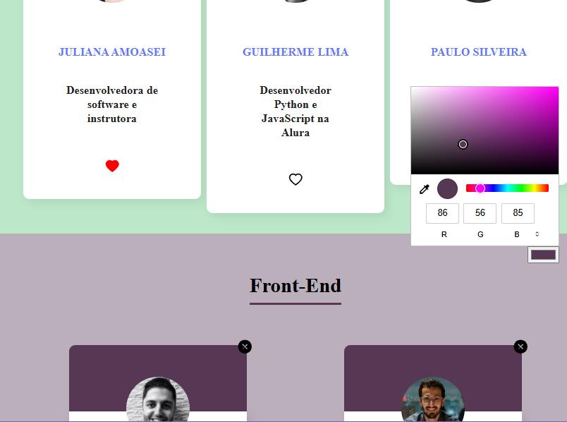

# Organo


sistema de cadastro e gerenciamento de colaboradores, desenvolvido em React a partir da estrutura inicial do projeto até a implementação completa da interface, baseada em um layout do Figma.
O foco do projeto é aplicar e entender, na prática, conceitos centrais do React, como componentização, gerenciamento de estado e renderização dinâmica. Ele foi desenvolvido com base no curso “React: desenvolvendo com JavaScript”,

Este repositório apresenta **minhas contribuições específicas** e aprendizados ao longo do desenvolvimento.

Na aplicação, o usuário pode cadastrar colaboradores por meio de um formulário, associá-los a uma categoria (time) e visualizar os dados sendo atualizados dinamicamente conforme as interações.

## Minhas Contribuições

- **Inicialização e organização do projeto:** O projeto foi iniciado com Create React App (CRA), seguido da remoção de arquivos e imports desnecessários do boilerplate para manter o código limpo e organizado.
  Como apoio ao desenvolvimento, foi utilizado o React.StrictMode, que atua apenas em ambiente de desenvolvimento, sem impactar a interface ou a versão de produção, ajudando a identificar alertas e erros comuns antecipadamente.
- **Componetização da interface:** Foram criados e integrados componentes reutilizáveis, seguindo os princípios de separação de responsabilidades e composição do React. Essa abordagem facilitou a manutenção do código e a evolução gradual da interface.
- **Gerenciamento de estado com React Hooks:** A comunicação entre componentes ocorre via props, aplicando conceitos como:
  - Interpolação e concatenação de props.
  - Passagem de funções como propriedades para comunicação filho → pai.
  - Evitar prop drilling excessivo, mantendo uma hierarquia clara (a Context API foi apenas apresentada em aula, mas não utilizada no projeto).
- **fluxo de dados com React Hooks:** O controle de dados da aplicação foi feito utilizando o hook useState, especialmente para:
  - Gerenciar os valores dos inputs do formulário.
  - Controlar o fluxo de cadastro de colaboradores.
  - Centralizar o estado principal no componente App.
- **Renderização dinâmica e controle condicional:** A renderização da aplicação é feita de forma dinâmica utilizando o método map() para exibir os times e seus colaboradores, combinada com renderização condicional para evitar a exibição de times vazios. Nesse processo, a prop key foi aplicada corretamente nas listas, garantindo melhor desempenho e prevenindo avisos do React.

<p align="center">
  
  
</p>

## Tecnologias Utilizadas

- HTML5
- CSS 3
- JavaScript (ES6+)
- React
  
  ⚙️ Técnicas:

- Componentização com **componentes funcionais**
- Gerenciamento de estado com **useState**
- Comunicação entre componentes via **props**
- Formulários controlados com **onChange** e **onSubmit**
- Renderização dinâmica com **map()**
- Renderização condicional no JSX
- Uso adequado da prop **key** em listas

## Como Ter Acesso ao Projeto

- **Versão online**: [Clique aqui](https://organo-omega-nine-12.vercel.app/)
- **Rodar localmente**:

1. Clone este repositório:
  ```bash
   git clone https://github.com/chiquinelli-bia/Organo.git

   ```

4. Acesse a pasta do projeto:

   ```bash
   cd Organo

   ```

5. Instale as dependências:

   ```bash
   npm install

   ```

6. Inicie o servidor de desenvolvimento:

   ```bash
   npm run dev

   ```

7. Abra no navegador o endereço exibido no terminal e Navegue pelas funcionalidades implementadas.

## Créditos

- Projeto original: 
- Instrutor(es) e curso: Paulo Silveira e Vinicios Neves,  - Este repositório destaca **apenas minhas contribuições** ao projeto
