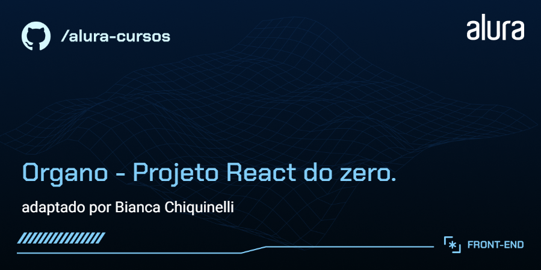
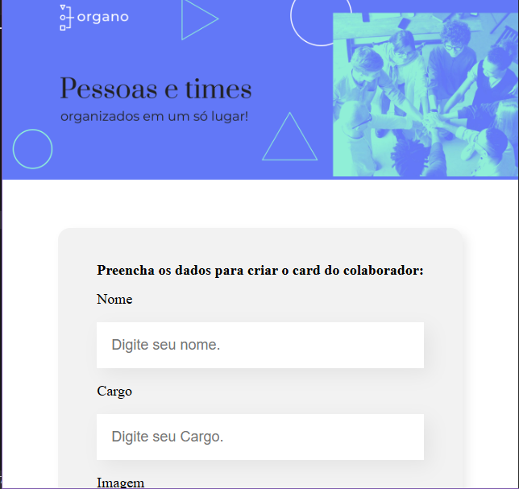

# Organo


O **Organo** é uma aplicação web para **cadastro e gerenciamento de colaboradores e times**, baseada em um layout do Figma.

O projeto foi construído do zero com foco na aplicação prática de conceitos centrais do React — como **componentização, gerenciamento de estado, comunicação via props e renderização dinâmica** — além de atenção ao **funcionamento interno, Performance e previsibilidade da aplicação**.

Na aplicação, o usuário pode cadastrar colaboradores e times por meio de um formulário intuitivo, associá-los a categorias, favoritar, remover registros e visualizar as alterações refletidas imediatamente na interface.

Todas as interações são sincronizadas em tempo real com o estado da aplicação, garantindo uma experiência fluida, previsível e responsiva.

Este repositório apresenta **minhas contribuições técnicas e aprendizados**, evidenciando decisões de arquitetura, padrões adotados e evolução do código ao longo do desenvolvimento.

## Minhas Contribuições

- **Inicialização e organização do projeto:**  
  Estruturação do projeto com Create React App (CRA), seguida da limpeza do boilerplate padrão para garantir uma base de código mais enxuta e organizada.
  Utilização do `React.StrictMode` em ambiente de desenvolvimento para antecipar alertas, identificar padrões problemáticos e reforçar boas práticas desde o início do projeto.
- **Componetização da interface:**
  Criação de componentes funcionais reutilizáveis, seguindo princípios de separação de responsabilidades e composição do React, facilitando a manutenção, leitura e evolução da interface ao longo do projeto.
- **Gerenciamento de estado com React Hooks:**
  Implementação da comunicação entre componentes por meio de `props`, incluindo passagem de dados e funções para interação entre componentes pai e filho.
  Foram exploradas diferentes abordagens de passagem de props para compreender impactos em clareza, organização e manutenção do código, sempre mantendo uma hierarquia previsível e evitando prop drilling
- **Fluxo de dados com React Hooks:**  
  Centralização do estado principal no componente `App` utilizando `useState`, garantindo controle previsível dos dados, fácil rastreabilidade das alterações e sincronização imediata entre estado e interface.
- **Renderização dinâmica e controle condicional:** Renderização automática de times e colaboradores a partir do estado da aplicação, utilizando listas dinâmicas e renderização condicional para evitar exibições desnecessárias, garantindo melhor desempenho e organização visual.
  lhor desempenho e prevenindo avisos do React.
- **Uso de bibliotecas externas e boas práticas:** Integração de bibliotecas auxiliares para ganho de produtividade e melhor experiência do usuário, mantendo o código desacoplado e alinhado às boas práticas do ecossistema React.
  - `UUID` para geração de identificadores únicos.
  - `React Icons` para implementação de ícones interativos.
  - `hex-to-rgba` para manipulação de cores com transparência.
- **Camada de formulários e operações CRUD:**
  -Implementação de formulários controlados seguindo o fluxo de dados unidirecional do React (one-way data binding), garantindo previsibilidade e reduzindo erros de sincronização conforme a aplicação evolui.
  -Criação e renderização dinâmica de times e colaboradores conforme as interações do usuário, utilizando `map()` e renderização condicional. melhorando a experiência e a escalabilidade.
  -Atualização de propriedades dos times, como a alteração dinâmica da cor de fundo, com propagação de eventos via `props` e sincronização imediata entre estado global e interface, seguindo o modelo declarativo do React. mantendo o código limpo, declarativo e sem manipulação direta do DOM.
  -Implementação da funcionalidade de Remoção de colaboradores por meio de ações disparadas no componente filho, E de favoritar colaboradores, alternando o estado individual de cada item e refletindo visualmente a interação com ícones dinâmicos. garantindo resposta imediata às ações do usuário edemonstrando controle preciso de estado por item e foco em experiência do usuário.

_🔄 O projeto utiliza diferentes abordagens de passagem de props de forma intencional, como parte de um processo de aprendizado e validação de padrões do React.  
Essas variações permitem avaliar impactos em legibilidade, manutenção e organização do código. Refatorações estão planejadas para padronização, mantendo o histórico como evidência da evolução técnica._

<p align="center">
  
  
</p>

## Tecnologias Utilizadas

- HTML5
- CSS 3
- JavaScript (ES6+)
- React
- npm (gerenciamento de dependências)

⚙️ Técnicas:

- Componentização com `componentes funcionais`
- Gerenciamento de estado com `useState`
- Comunicação entre componentes via `props`
- Formulários controlados com `onChange` e `onSubmit`
- Renderização dinâmica com `map()`
- Renderização condicional no JSX
- Uso adequado da prop `key` em listas
- Integração de bibliotecas externas via npm (`UUID`, `React Icons`, `hex-to-rgba`)
- Fluxo de dados unidirecional (one-way data binding)
- Comunicação entre componentes via props (incluindo passagem de funções)

## Como Ter Acesso ao Projeto

- **Versão online**: [Clique aqui](https://organo-omega-nine-12.vercel.app/)
- **Rodar localmente**:

1. Clone este repositório:

```bash
 git clone https://github.com/chiquinelli-bia/Organo.git

```

4. Acesse a pasta do projeto:

   ```bash
   cd Organo

   ```

5. Instale as dependências:

   ```bash
   npm install

   ```

6. Inicie o servidor de desenvolvimento:

   ```bash
   npm run dev

   ```

7. Abra no navegador o endereço exibido no terminal e Navegue pelas funcionalidades implementadas.

## Créditos

- Projeto original: 
- Instrutor(es) e curso: Paulo Silveira e Vinicios Neves , Luiz Fernando Ribeiro  - Este repositório destaca **apenas minhas contribuições** ao projeto
