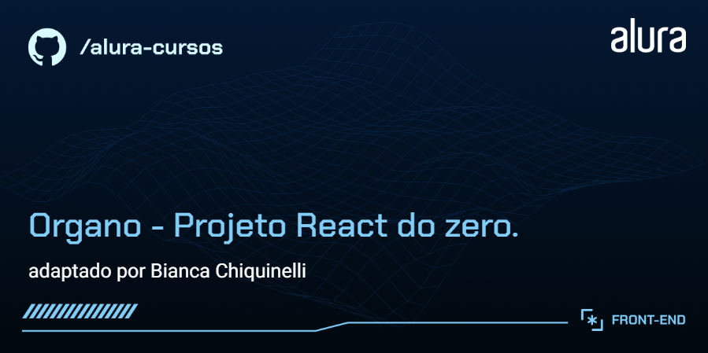
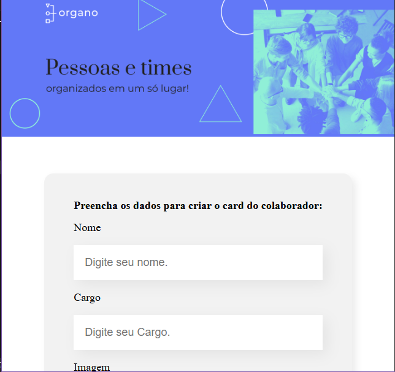
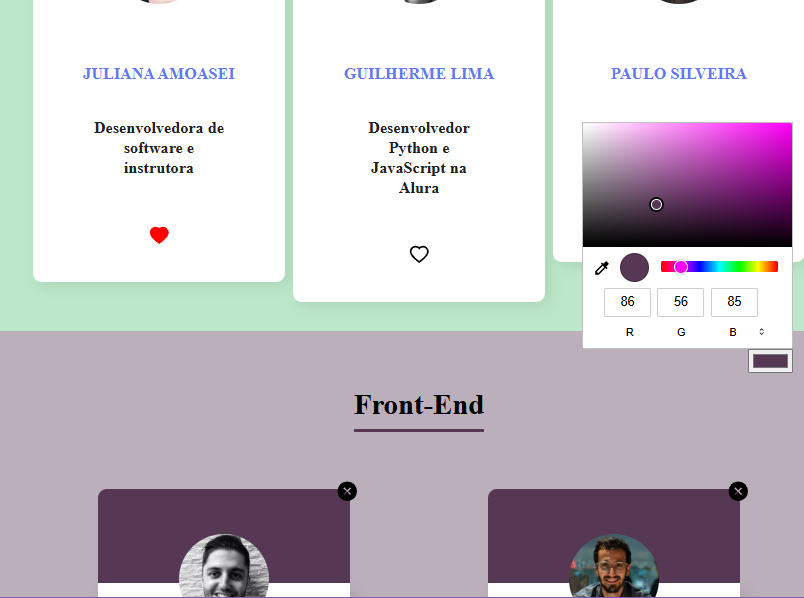

# Organo


O **Organo** é uma aplicação web para **cadastro e gerenciamento de colaboradores e times**, baseada em um layout do Figma.

O projeto foi construído do zero com foco na aplicação prática de conceitos centrais do React — como **componentização, gerenciamento de estado, comunicação via props e renderização dinâmica** — além de atenção ao **funcionamento interno, Performance e previsibilidade da aplicação**.

Na aplicação, o usuário pode cadastrar colaboradores e times por meio de um formulário intuitivo, associá-los a categorias, favoritar, remover registros e visualizar as alterações refletidas imediatamente na interface.

Todas as interações são sincronizadas em tempo real com o estado da aplicação, garantindo uma experiência fluida, previsível e responsiva.

Este repositório apresenta **minhas contribuições técnicas e aprendizados**, evidenciando decisões de arquitetura, padrões adotados e evolução do código ao longo do desenvolvimento.

## Minhas Contribuições

- Estruturei a aplicação com foco em organização e escalabilidade, removendo boilerplate e aplicando boas práticas desde o início (React Strict Mode).
- Desenvolvi uma arquitetura baseada em componentes reutilizáveis, priorizando separação de responsabilidades e manutenção.
- Implementei gerenciamento de estado com `useState`, centralizando dados no componente principal para garantir previsibilidade.
- Construí um fluxo completo de CRUD (criação, exibição, atualização e remoção de colaboradores e times).
- Apliquei renderização dinâmica e condicional para refletir o estado em tempo real na interface.
- Integrei bibliotecas externas para otimizar a experiência e produtividade (`UUID`, `React Icons`, `hex-to-rgba`).

### Evolução com TypeScript

- Migrei a aplicação de JavaScript para TypeScript, aumentando a previsibilidade e a segurança do código.
- Defini interfaces para tipagem de props, garantindo contratos claros entre componentes.
- Refatorei o gerenciamento de estado no componente `App`, adicionando tipagem ao estado global.
- Padronizei a tipagem em toda a aplicação (`Banner`, `Form`, `Campo`, `Dropdown`, `Time`, `Colaborador`, `Footer`), promovendo consistência e legibilidade.
- Ajustei dependências e estrutura do projeto para suportar o ambiente TypeScript.
- Evoluí a camada de formulários com novos campos (como data), mantendo consistência na tipagem e no fluxo de dados.
- Inclusão de novos campos (como data) e adequação da tipagem para suportar novos formatos de dados, mantendo consistência no fluxo da aplicação.

_🔄 O projeto explora diferentes abordagens de composição e passagem de props de forma intencional, permitindo análise de trade-offs entre legibilidade, manutenção e escalabilidade. Refatorações futuras visam padronização dessas estratégias._

<p align="center">
  
  
</p>

## Tecnologias Utilizadas

- HTML5
- CSS 3
- JavaScript (ES6+)
- TypeScript
- React
- npm (gerenciamento de dependências)

⚙️ Técnicas:

- Componentização com `componentes funcionais`
- Gerenciamento de estado com `useState`
- Comunicação entre componentes via `props`
- Formulários controlados com `onChange` e `onSubmit`
- Renderização dinâmica com `map()`
- Renderização condicional no JSX
- Uso adequado da prop `key` em listas
- Integração de bibliotecas externas via npm (`UUID`, `React Icons`, `hex-to-rgba`)
- Fluxo de dados unidirecional (one-way data binding)
- Comunicação entre componentes via props (incluindo passagem de funções)

### 🚀 Evolução do Projeto

Este projeto passou por uma evolução incremental, partindo de uma base em JavaScript para uma arquitetura tipada com TypeScript.

A migração foi realizada de forma progressiva, permitindo identificar na prática os ganhos em segurança, legibilidade e manutenção do código, além de evidenciar trade-offs entre flexibilidade e robustez.

Essa abordagem reflete um cenário comum no mercado, onde aplicações existentes são gradualmente adaptadas para TypeScript.

## Como Ter Acesso ao Projeto

- **Versão online**: [Clique aqui](https://organo-omega-nine-12.vercel.app/)
- **Rodar localmente**:

1. Clone este repositório:

```bash
 git clone https://github.com/chiquinelli-bia/Organo.git

```

4. Acesse a pasta do projeto:

   ```bash
   cd Organo

   ```

5. Instale as dependências:

   ```bash
   npm install

   ```

6. Inicie o servidor de desenvolvimento:

   ```bash
   npm run dev

   ```

7. Abra no navegador o endereço exibido no terminal e Navegue pelas funcionalidades implementadas.

## Créditos

Projeto base inspirado na formação de React com JavaScript da Alura.

Este repositório representa minha implementação prática, com adaptações, decisões técnicas próprias e evolução do código ao longo do desenvolvimento.

## 📚 Referências de Estudo

Para quem deseja seguir uma base semelhante de aprendizado, este projeto foi inspirado nos seguintes cursos:

-  — Alura
-  — Alura
-  — Alura
